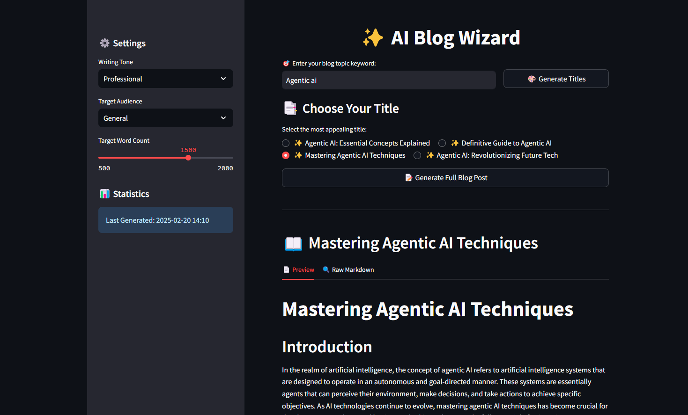

# ✨ AI Blog Wizard



> Transform your ideas into engaging blog posts with the power of AI! 🚀

## 🌟 Features

- 🎯 Intelligent title generation
- 📝 Full blog post creation
- 🎨 Multiple writing tones
- 📊 Word count tracking
- 💾 Export to Markdown/Text
- 🎭 Customizable target audience
- ⚡ Powered by Qwen-2.5-32b

## 🚀 Getting Started

### Prerequisites

- Python 3.8+
- Groq API key
- Streamlit
- LangGraph

### 🛠️ Installation

1. Clone the repository:
   ```
   git clone https://github.com/Rizwankaka/langgraph-blog-generator.git
   ```

   ```
   cd langgraphBlogPost.py
   ```

2. Install dependencies:

   ```
   pip install -r requirements.txt
   ```
3. Set up your environment variables:

   ```
   cp .env.example .env
   ```

# Add your Groq API key to .env file

4. Run the application:
   ```
   streamlit run langgraphBlogPost.py
   ```

## 🎮 Usage

1. 🎯 Enter your blog topic keyword
2. 🎨 Generate multiple title options
3. ✅ Select your preferred title
4. 📝 Generate a full blog post
5. 💾 Download in your preferred format

## 🌈 Features in Detail

### Multiple Writing Tones

- Professional
- Casual
- Technical
- Conversational

### Target Audience Selection

- General
- Beginners
- Experts
- Students
- Professionals

### Customizable Content Length

- Adjustable word count (500-2000 words)
- Progress tracking
- Word count statistics

## 🤝 Contributing

Contributions are welcome! Please feel free to submit a Pull Request.

## 📄 License

This project is licensed under the MIT License - see the [LICENSE](LICENSE) file for details.

## 🙏 Acknowledgments

- Built with [Streamlit](https://streamlit.io/)
- Powered by [Groq](https://groq.com/)
- Uses [LangGraph](https://github.com/langchain-ai/langgraph)

## 📞 Support

For support, email rizwan.rewala@gmail.com or open an issue in the repository.

---

Made with ❤️ by Rizwan Rizwan for the community!
